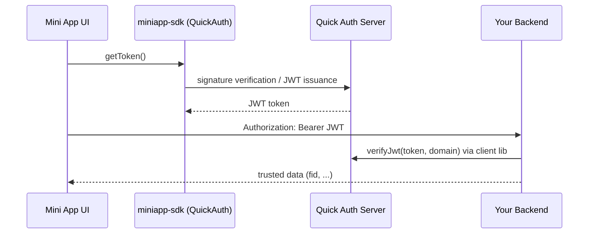
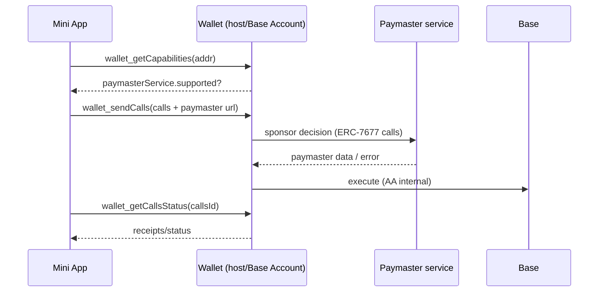
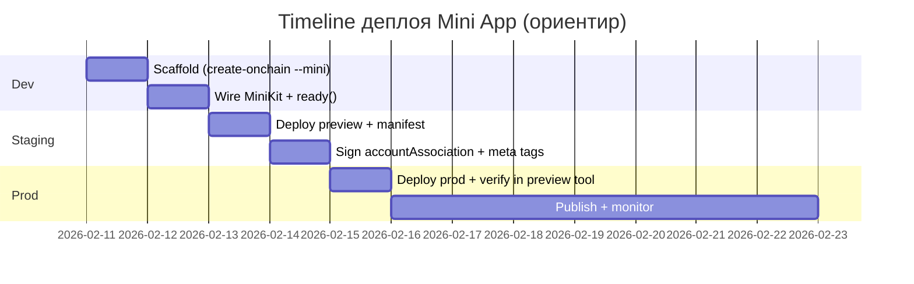

# Технический конспект по Mini Apps, Base Account/OnchainKit и Farcaster/Neynar

## Executive summary

Этот конспект — практическое техническое руководство (для разработчика и «модели кода») о том, как построить Mini App и безопасно встроить агента, который умеет выполнять ончейн‑действия и взаимодействовать внутри Mini App. Описаны архитектура, API/SDK, контракты, схемы данных, потоки аутентификации (Quick Auth/SIWF, SIWN), варианты signer’ов (fetch signers, managed signers, dedicated/developer‑managed), газ‑спонсорство/Paymasters (включая ERC‑20 paymasters), Spend Permissions, Sub Accounts и MagicSpend. citeturn13view0turn14view0turn6search21turn8search0turn4search0  

Скачать файл‑версию (Markdown): [miniapp_base_farcaster_agent_notes_ru.md](sandbox:/mnt/data/miniapp_base_farcaster_agent_notes_ru.md)

Рекомендуемая «точка сборки» по умолчанию:

- **Фронтенд Mini App (Next.js/React)**: `OnchainKitProvider` с `miniKit.enabled: true`, `useMiniKit()` для UX‑контекста и `setFrameReady()`/`sdk.actions.ready()` для скрытия splash. citeturn14view1turn15view0turn6search12  
- **Security‑аутентификация**: внутри Mini App — Quick Auth (SIWF) → JWT → backend `verifyJwt({ token, domain })`; для web/hybrid и для Farcaster write‑прав — SIWN (fid + signer_uuid). citeturn14view0turn7search7  
- **Ончейн‑действия**:
  - «Пользователь подписывает»: `wallet_sendCalls` (EIP‑5792) + feature‑detect `paymasterService` (ERC‑7677) и добавление paymaster URL только при поддержке. citeturn5search3turn4search6turn5search15  
  - «Агент исполняет автономно»: Spend Permission (EIP‑712) → `prepareSpendCallData` → spender выполняет `approveWithSignature`+`spend` через `SpendPermissionManager`. citeturn8search0turn8search1turn8search11  
- **Farcaster write (касты/лайки/рекасты)**: через Neynar выбирайте signer‑стратегию под UX: SIWN, Neynar‑managed signers, developer‑managed/dedicated. citeturn11view0turn12search1turn10view1  
- **Агент‑платформа**: entity["company","Coinbase Developer Platform","developer tools platform"] AgentKit — тулкит для AI‑агентов с безопасным wallet management и onchain действиями (built on CDP SDK), совместим с разными AI‑frameworks. citeturn13view1turn13view0  

Критическое ограничение, влияющее на дизайн: в документации Base указано, что в Mini Apps (запущенных в Base App) «пока не поддержаны» некоторые RPC/возможности Base Account (например `wallet_connect`, sub accounts, spend permissions, message signing и др.). Поэтому для фич, связанных с Spend Permissions/Sub Accounts, нужен **feature‑detect + fallback** или гибридный режим (не только embedded). citeturn4search7turn5search7  

## Исходные материалы и область охвата

### Что было предоставлено вами

Загруженные архивы (локальные копии кода/примеров) использовались как практические референсы, но **все ключевые утверждения** в конспекте опираются на официальные источники и публичные репозитории.

- `agentkit-main.zip` — AgentKit (сопоставимо с официальной документацией). citeturn13view1  
- `demos-master.zip` — набор демо Base, включая шаблоны Mini Apps и примеры Base Account/AA (использовано как ориентир по структуре проектов). citeturn17search0  
- `BaseRFarcaster-main.zip` — минимальный пример `launch_miniapp` и `sdk.wallet.getEthereumProvider()`. citeturn15view0turn6search3  
- `farcaster_frame-main.zip` — отдельный пример “frames‑style” приложения (полезен как «минимальный Next.js + Farcaster embed» пример, но не заменяет Mini App SDK). citeturn9search15  
- `BaseR-main.zip` — Solidity verify bundle («не указано», как связан с Base Account; см. варианты ниже).  
- `agent-apps-master.zip` — экспериментальный шаблон agent‑only приложений с `fishnet-auth` (reverse‑CAPTCHA). Использовано как отдельный паттерн «аутентификация агентов», не как часть официального стека Base/Farcaster/Neynar. citeturn17search1turn17search3  

Отдельная пометка по `BaseR-main.zip`: в предоставленных материалах **не указано**, какой именно продукт/контрактный слой это представляет и как он должен стыковаться с Mini Apps/Base Account. Возможные варианты интеграции (выберите явно):

- Вариант A: это самостоятельный dApp/контракт, и Mini App выступает «фронтендом» (UX + auth + wallet_sendCalls/paymaster) к этому контракту.
- Вариант B: это onchain‑utility, которую вы хотите предоставить агенту как tool (агент готовит calldata, а исполнение — HITL через кошелёк пользователя).
- Вариант C: это часть «бэкенда платформы» (например launcher/deployer), и Mini App лишь управляет доступом и отображением статусов.

Без явного описания ABI/адресов/целевых методов («не указано») в этом конспекте невозможно корректно описать конкретные вызовы/права; используйте общие паттерны Paymaster/Spend Permissions/Sub Accounts, описанные ниже.

### Официальные источники, на которые опирается конспект

Приоритет:

- Base docs: Mini Apps (manifest/auth/notifications), OnchainKit/MiniKit, Base Account (paymasters, spend permissions, sub accounts, MagicSpend) и cookbook по AI agents. citeturn6search2turn14view0turn14view3turn14view1turn4search0turn8search0turn5search1turn4search2turn13view0  
- Farcaster Mini Apps: спецификация, publishing, wallet provider, capability detection. citeturn9search15turn6search21turn6search3turn9search13turn17search14  
- Neynar: SIWN и signer management (включая miniapp authentication flow и способы получать/проверять signer’ы). citeturn7search7turn11view0turn12search1turn12search0turn7search2turn12search5  
- CDP: AgentKit, Paymaster quickstart, server wallets spend permissions. citeturn13view1turn4search9turn8search8  

### Что «не указано» и как это влияет на реализацию

Параметры, без которых нельзя выбрать единственный «правильный» вариант (в конспекте приведены варианты и места принятия решения):

- Целевой host: Base App vs entity["company","Warpcast","farcaster client app"] /другие Farcaster клиенты; или one‑deploy гибрид. citeturn6search1turn9search15  
- Сеть (mainnet/testnet), модель оплаты газа (sponsor gas / ERC‑20 paymaster / user-paid). citeturn4search0turn4search1turn5search14  
- Режим агента: полностью autonomous vs HITL (подтверждение человеком) в зависимости от класса действий. citeturn13view0turn8search0  
- LLM и стек агента (framework, streaming, tool calling). В Base “Launch AI Agents” перечислены ключи, включая entity["company","OpenAI","ai lab"] API key как пример для AI capabilities. citeturn13view0  

## Архитектура Mini App и ключевые компоненты

### Минимальная спецификация Mini App

Mini Apps — web‑приложения, рендерящиеся внутри клиентов Farcaster; спецификация описывает вертикальный модальный режим (на web — 424×695px), splash‑экран, SDK‑взаимодействие и манифест. citeturn9search15turn6search10  

SDK предоставляет API:

- `sdk.actions.ready()` — скрыть splash, когда UI готов. citeturn15view0turn9search15  
- `sdk.wallet.getEthereumProvider()` — EIP‑1193 provider кошелька пользователя. citeturn6search3turn9search5  
- `sdk.getCapabilities()` и `requiredCapabilities` в манифесте — способ не ломаться на hosts без нужных фич. citeturn9search13turn6search14  

### MiniKit и OnchainKit как официальный “high-level слой”

MiniKit — официальный SDK (часть OnchainKit) для создания Mini Apps, которые работают «сквозно» (Base App + Farcaster clients): React hooks, контекст, wallet‑интеграция. citeturn6search1turn14view1turn6search12  

Базовая интеграция:

1) Оборачиваем приложение `OnchainKitProvider` и включаем `miniKit.enabled`. citeturn14view1turn6search12  
2) В рантайме вызываем `setFrameReady()` (MiniKit) — чтобы host снял splash. citeturn14view1  
3) Берём UX‑контекст через `useMiniKit().context`, но **не используем его как auth**. citeturn14view1turn18view0  

### Манифест и доказательство домена

Публикация Mini App осуществляется через размещение `/.well-known/farcaster.json` (манифест) на домене приложения; клиенты используют этот файл для верификации автора, отображения в discovery surfaces и уведомлений. citeturn6search21turn9search15turn6search2  

В манифесте:

- `accountAssociation` доказывает владение доменом Farcaster аккаунтом (custody/auth). `domain` в payload должен совпадать с FQDN. citeturn9search15turn6search5turn6search2  
- `miniapp` описывает homeUrl, иконки, webhookUrl, категории, теги, OG‑данные и т.д. citeturn6search2turn9search15  

### Embed metadata и запуск из фида

Чтобы ссылка на ваше приложение рендерилась как rich embed с кнопкой запуска, Base quickstart рекомендует добавить в HTML meta‑тег `fc:miniapp`. Это JSON, где задаются `version: "next"`, `imageUrl`, текст кнопки и `action.type = "launch_miniapp"` с `url` вашего приложения. citeturn15view0  

Пример (index.html):

```html
<meta name="fc:miniapp" content='{
  "version": "next",
  "imageUrl": "https://your-app.com/embed-image",
  "button": {
    "title": "Play Now",
    "action": {
      "type": "launch_miniapp",
      "name": "Your App Name",
      "url": "https://your-app.com"
    }
  }
}' />
```

Замечание: в более старых «Frame» примерах может встречаться `fc:frame`, но для Mini Apps в документации используется `fc:miniapp`. citeturn15view0  

### API/SDK “чек‑лист” компонентов в типичном проде

Чтобы встроить агента и ончейн‑действия, почти всегда нужны:

- **Frontend**: miniapp-sdk (actions/wallet/quickAuth), OnchainKit/MiniKit, wagmi/viem для контрактных вызовов. citeturn9search15turn14view1turn9search5  

Минимальный wagmi setup для Mini App кошелька (рекомендуемый Farcaster подход — через `@farcaster/miniapp-wagmi-connector`):

```ts
import { http, createConfig } from "wagmi";
import { base } from "wagmi/chains";
import { farcasterMiniApp } from "@farcaster/miniapp-wagmi-connector";

export const config = createConfig({
  chains: [base],
  transports: { [base.id]: http() },
  connectors: [farcasterMiniApp()],
});
```

citeturn9search5  

- **Backend**: quick-auth verify (JWT), agent orchestrator (LLM), onchain executor (AgentKit или custom viem/AA), storage (DB), rate limiting. citeturn14view0turn13view1turn13view2  
- **Social writes**: Neynar Node SDK + signer_uuid (SIWN/managed), либо dedicated signer flow. citeturn7search18turn12search1turn10view1  
- **Notifications**: webhook endpoint + валидация событий и хранение notification tokens (особенно важна разница поведения Base App vs Farcaster clients). citeturn14view3turn6search24  

### Notifications и webhookUrl

Mini Apps могут отправлять уведомления пользователям; для этого в манифесте указывается `webhookUrl`, а на backend нужно принимать и **валидировать** события. В документации Base для уведомлений упоминаются утилиты, которые помогают разобрать/валидировать webhook‑payload (`parseWebhookEvent`) и проверить app key через Neynar (`verifyAppKeyWithNeynar`). citeturn6search24turn14view3turn6search25  

Минимальная идея backend‑эндпоинта (псевдо‑скелет; точные API/типы сверяйте с docs):

```ts
export async function POST(req: Request) {
  const rawBody = await req.text();
  const headers = Object.fromEntries(req.headers.entries());

  // 1) parseWebhookEvent(rawBody, headers) -> type-safe event
  // 2) verifyAppKeyWithNeynar(...) -> ensure event действительно от вашего app key
  // 3) обработать event и вернуть 2xx
  return new Response("ok");
}
```

Практика безопасности: webhook endpoint должен быть идемпотентным, выдерживать повторы, и не выполнять «чувствительные» действия без дополнительной проверки пользователя/контекста. citeturn14view3  

### Схемы данных, которые полезно держать «под рукой»

Минимальные структуры (упрощены; ориентируйтесь на актуальные поля в docs):

**Manifest `/ .well-known/farcaster.json` (ядро):**
```json
{
  "accountAssociation": { "header": "...", "payload": "...", "signature": "..." },
  "miniapp": { "version": "1", "name": "...", "homeUrl": "https://...", "iconUrl": "https://..." }
}
```
citeturn6search2turn9search15  

**Quick Auth JWT payload (пример):**
```json
{ "iss": "https://auth.farcaster.xyz", "sub": 6841, "aud": "your-domain.com", "iat": 1747764819, "exp": 1747768419 }
```
citeturn14view0  

**SpendPermission (логика полей):**
```json
{
  "permissionHash": "...",
  "signature": "...",
  "chainId": 8453,
  "permission": { "account": "0x...", "spender": "0x...", "token": "0x...", "allowance": "bigint", "period": 86400, "start": 0, "end": 0 }
}
```
citeturn8search2turn8search1  

### Сценарий: Создание и публикация новой Mini App

#### Пошагово

1) Создайте проект: `npx create-onchain --mini`. citeturn6search0  
2) Встроите MiniKit/SDK:
   - `OnchainKitProvider` + `useMiniKit().setFrameReady()` или `sdk.actions.ready()`. citeturn14view1turn15view0  
3) Поднимите `/.well-known/farcaster.json` (Next.js route handler). citeturn6search17turn15view0  
4) Сгенерируйте `accountAssociation` и вставьте в манифест. При подписании Base Account подпись может быть длиннее. citeturn6search5turn15view0turn6search2  
5) Добавьте embed meta (`fc:miniapp`) в `index.html`/layout. citeturn15view0  
6) Проверьте preview tool; публикуйте URL постом. citeturn6search20turn17search0turn6search21  

#### Пример кода (Next.js: /.well-known/farcaster.json)

```ts
// app/.well-known/farcaster.json/route.ts
export async function GET() {
  const URL = process.env.NEXT_PUBLIC_URL;

  return Response.json({
    accountAssociation: {
      header: process.env.FARCASTER_HEADER ?? "",
      payload: process.env.FARCASTER_PAYLOAD ?? "",
      signature: process.env.FARCASTER_SIGNATURE ?? "",
    },
    miniapp: {
      version: "1",
      name: "My Mini App",
      homeUrl: URL,
      iconUrl: `${URL}/icon.png`,
      splashImageUrl: `${URL}/splash.png`,
      splashBackgroundColor: "#000000",
      webhookUrl: `${URL}/api/webhook`,
      subtitle: "…",
      description: "…",
      screenshotUrls: [`${URL}/s1.png`],
      primaryCategory: "social",
      tags: ["base", "miniapp"],
      heroImageUrl: `${URL}/hero.png`,
      ogTitle: "My Mini App",
      ogDescription: "…",
      ogImageUrl: `${URL}/og.png`,
    },
  });
}
```

#### Необходимые права и настройки

- Манифест должен быть доступен по HTTPS на том же FQDN, который в `accountAssociation.payload.domain`. citeturn15view0turn9search15  
- Если включены notifications, нужен webhook и корректная обработка токенов. citeturn14view3turn6search24  

#### Риски и mitigations

- Несоответствие домена ломает discovery/auth: автоматизируйте env и тестируйте через preview tool. citeturn6search20turn14view0turn15view0  
- Не вызвали `ready()`/`setFrameReady()`: вызывать как можно раньше. citeturn15view0turn9search15  

#### Чек‑лист ревью

- [ ] `/.well-known/farcaster.json` валиден и публичен  
- [ ] домен совпадает с `accountAssociation`  
- [ ] `ready()` вызывается один раз  
- [ ] `requiredCapabilities`/runtime detection применён, если требуется wallet/actions citeturn9search13  

## Аутентификация и управление подписями

### Контекст vs безопасность

`useMiniKit().context` удобен для UX, но может быть spoofed; для security‑операций используйте Quick Auth или `useAuthenticate()` и **серверную проверку**. citeturn14view1turn18view0turn14view0  

### Сценарий: Quick Auth (SIWF) в Mini App

Официальный поток: frontend получает JWT через `sdk.quickAuth.getToken()`, вызывает backend через `sdk.quickAuth.fetch` с Bearer, backend проверяет JWT через `@farcaster/quick-auth` и `domain` (aud). citeturn14view0turn7search13  

#### Диаграмма потока Quick Auth



citeturn14view0turn7search13turn9search15  

#### Пошагово

1) На фронтенде: `getToken()` → `token` хранить в памяти. citeturn14view0  
2) На фронтенде: вызывать backend только с `Authorization: Bearer <token>`. citeturn14view0  
3) На backend: `verifyJwt({ token, domain })` и возвращать минимальный trusted context (например `fid`). citeturn14view0  
4) На backend: для всех sensitive endpoint’ов требовать verified FID (не контекст). citeturn14view0turn18view0  

#### Код (frontend + backend snippets)

```ts
// frontend
import { sdk } from "@farcaster/miniapp-sdk";
export async function signIn() {
  const { token } = await sdk.quickAuth.getToken();
  return token;
}
```

```ts
// backend (Next.js route handler идея)
import { createClient } from "@farcaster/quick-auth";
const client = createClient();
export async function verify(authzHeader: string) {
  const token = authzHeader.replace("Bearer ", "");
  const payload = await client.verifyJwt({ token, domain: process.env.APP_DOMAIN! });
  return Number(payload.sub);
}
```

#### Права/настройки, риски, чек‑лист

- `APP_DOMAIN` должен совпадать с доменом деплоя. citeturn14view0turn15view0  
- JWT краткоживущий; нужен re-auth. citeturn14view0  
- Чек‑лист: no localStorage, verifyJwt на каждый чувствительный запрос, не доверять `context`. citeturn18view0turn14view1  

### Sign in with Base и SIWE в обычных web‑приложениях

Если вы строите **не embedded Mini App**, а обычный web‑app, Base Account SDK поддерживает login‑флоу через `wallet_connect` с capability `signInWithEthereum` (это SIWE‑подобный подход). В примерах Base (например интеграция с Privy) описывается, что это используется для Base Account authentication и SIWE-проверки на сервере. citeturn8search5turn4search7  

Важно: в документации по Base Account в Mini Apps отдельно отмечено, что `wallet_connect` может быть не поддержан в embedded окружении, поэтому этот флоу нужно рассматривать как web/hybrid‑опцию. citeturn4search7  

(Не указано: ваш конкретный nonce/session протокол. Рекомендация: nonce на сервере → подпись на клиенте → проверка на сервере → короткоживущая сессия.)

### Сценарий: SIWN (Sign In With Neynar) как auth+write для web/hybrid

SIWN позволяет «в один шаг» подключить Farcaster account и получить `fid` + `signer_uuid` для write‑операций. Документация подчёркивает важность `authorized origins` и хранения signer_uuid. citeturn7search7turn7search0  

#### Пошагово

1) В Neynar portal: Name/Logo/Authorized origins/Permissions. citeturn7search7  
2) В frontend: `<NeynarAuthButton />` и получение контекста `user` (включая signer_uuid). citeturn7search0turn7search7  
3) На backend: сохранить `signer_uuid` и привязать к вашему пользователю. citeturn7search7  
4) Для write: backend вызывает Neynar SDK с этим signer_uuid. citeturn7search0turn12search1  

#### Пример кода (React)

```tsx
"use client";
import { NeynarAuthButton, useNeynarContext } from "@neynar/react";

export function Login() {
  const { user } = useNeynarContext();
  return user ? <div>FID: {user.fid}</div> : <NeynarAuthButton />;
}
```

#### Риски/mitigations + чек‑лист

- Риск: signer_uuid утёк через XSS. Mitigation: хранить server-side, CSP. citeturn7search7  
- Чек‑лист: signer_uuid не логируется, 403 InsufficientPermission обработан, origins настроены без wildcard. citeturn7search7  

### Fetch signers / managed signers / dedicated signers

Neynar “Choose the Right Signer” даёт рамку выбора: SIWN (plug‑and‑play), managed signers (ваш брендинг при хранении у Neynar), developer‑managed (вы храните ключи). citeturn11view0  

#### Таблица: сравнение signer‑опций

| Опция | Где приватный ключ signer’а | Онбординг | Кастомизация | Кто платит/спонсирует | Типичные риски |
|---|---|---|---|---|---|
| SIWN | Neynar | 1 шаг | ограничена | часто sponsor’ится | утечка signer_uuid на клиенте citeturn7search7 |
| Neynar‑managed | Neynar | auth + approve | высокая | можно sponsor | компрометация app mnemonic / polling ошибки citeturn7search1turn12search0 |
| Developer‑managed/dedicated | вы | onchain approval | максимальная | вы/пользователь | key custody, бэкапы, утечки citeturn10view1turn11view0 |

#### Сценарий: Neynar‑managed signer (backend) — пошагово и код

Базовый managed flow по документации Neynar:

1) `createSigner` → `signer_uuid` + `public_key`. citeturn7search2  
2) `registerSignedKey` (app_fid, deadline, signature, signer_uuid; optional sponsor) → approval URL. citeturn12search5  
3) Poll `lookupSigner` до approved. citeturn12search0turn12search1  

Код‑скелет (backend, ориентир на docs):

```ts
import { Configuration, NeynarAPIClient } from "@neynar/nodejs-sdk";

const client = new NeynarAPIClient(new Configuration({ apiKey: process.env.NEYNAR_API_KEY! }));

export async function ensureSignerApproved() {
  const signer = await client.createSigner(); // returns signer_uuid, public_key, status
  // Далее: сгенерировать EIP-712 signature и вызвать registerSignedKey(...)
  return signer;
}
```

Права и настройки (managed signers):

- `NEYNAR_API_KEY` — обязателен для всех запросов. citeturn12search5turn12search0  
- `SEED_PHRASE`/mnemonic для app developer account — нужен, чтобы подписать EIP‑712 payload для `registerSignedKey` (пример в Neynar miniapp auth). citeturn12search1turn12search5  
- `app_fid` — FID вашего приложения; в примерах Neynar его получают через `lookupUserByCustodyAddress`. citeturn12search1  
- (опционально) sponsor‑параметры: `registerSignedKey` поддерживает объект `sponsor` (в т.ч. `sponsored_by_neynar`). citeturn12search5turn12search1  

Риски и mitigations:

- Риск: компрометация seed phrase → возможность регистрировать ключи/подписывать запросы.  
  Mitigation: отдельный app‑account, секрет‑менеджер, запрет вывода секретов в логи, ротации. citeturn12search1turn7search1  
- Риск: user создаёт новые signer’ы каждый логин → рост расходов и сложность.  
  Mitigation: сначала `fetchSigners`, затем reuse approved, и только при отсутствии создавать новые. citeturn12search1  

Чек‑лист ревью (managed signers):

- [ ] createSigner вызывается только если нет approved signer  
- [ ] seed phrase не доступен из client-side  
- [ ] polling имеет таймаут и fallback UX  
- [ ] signer_uuid хранится server-side и привязан к user/session  

Примечание «не указано»: генерация EIP‑712 подписи для `registerSignedKey` зависит от того, как вы храните developer account (mnemonic/HSM). Neynar даёт пример на `@farcaster/hub-nodejs` и viem signer’ах. citeturn7search1turn12search5  

#### Сценарий: dedicated signer для бота/агента

Neynar описывает dedicated signer flow: генерируете signer и утверждаете его через onchain транзакцию (пример требует OP ETH на Optimism mainnet). citeturn10view1  

Farcaster contracts repo публикует адреса v3.1, включая KeyGateway на OP mainnet. citeturn16search1turn16search0  

Права и настройки (dedicated signer):

- Требуется funded кошелёк/аккаунт для onchain approval signer’а (в примере Neynar — Optimism mainnet). citeturn10view1turn16search1  
- Ключ signer’а хранится у вас (localhost/сервер/secret manager) — это основное security‑обязательство. citeturn11view0turn10view1  

Риски и mitigations:

- Риск: утечка signer private key → полный Farcaster write доступ.  
  Mitigation: HSM/secret manager, минимальные права доступа, регулярная ротация, отдельные ключи на окружения. citeturn11view0turn10view1  
- Риск: onchain approval ошибочно выполнен не тем owner/fid.  
  Mitigation: процессы “4-eyes”, скрипты‑валидации параметров, тест на staging. citeturn16search1turn16search0  

Чек‑лист ревью (dedicated signers):

- [ ] private key нигде не попадает в репозиторий/логи  
- [ ] approval tx параметры (fidOwner/keyType/key/metadata/deadline/sig) валидируются перед отправкой  
- [ ] есть процедура revoke/rotation  

## Ончейн‑действия агента, газ и разрешения

### Base Account в Mini Apps и ограничения

Base Account описан как Smart Wallet‑backed account с universal sign‑on, payments, gasless и batch transactions; Mini Apps внутри Base App автоматически подключены и избавляют от connect flows. citeturn4search7turn4search10  

Ограничения embedded: часть методов/возможностей “not supported in mini apps yet”. Это влияет на доступность Sub Accounts и Spend Permissions внутри Base App Mini App и требует fallback. citeturn4search7turn5search7  

### RPC и capabilities: что вам реально нужно

Чаще всего в Mini App onchain нужны:

- `wallet_getCapabilities` (EIP‑5792) — feature detect paymasterService/auxiliaryFunds и др. citeturn4search13turn4search6turn4search2  
- `wallet_sendCalls` (EIP‑5792) — батч вызовов (approve+swap, mint+transfer…). citeturn5search3turn5search22  
- `wallet_getCallsStatus` — отслеживание batched tx. citeturn5search15  

### Газ: paymasterService (ERC‑7677) и sponsor gas

Base описывает Sponsor Gas через paymaster web services (ERC‑7677 compliant) и `paymasterService` capability. citeturn4search0turn4search6  

`paymasterService`:

- проверяется через `wallet_getCapabilities`. citeturn4search13  
- содержит нормализованный error handling (4100/4200/4300/5700). citeturn4search6  
- помечен как «не финализирован» (может измениться). citeturn4search6  

### Сценарий: gasless ончейн‑действие пользователя из Mini App

#### Диаграмма “sendCalls + paymaster”



citeturn4search6turn5search3turn5search15  

#### Пошагово

1) Получить paymaster URL (например CDP paymaster quickstart). citeturn4search9turn4search0  
2) `wallet_getCapabilities` → проверить поддерживаемость paymasterService. citeturn4search6turn4search13  
3) `wallet_sendCalls` с paymaster URL только если supported. citeturn5search3turn4search6  
4) `wallet_getCallsStatus` для UX pending/failed/success. citeturn5search15  

#### Код (ориентир)

```ts
async function sendCallsWithOptionalPaymaster(provider: any, from: string, calls: Array<{to: string; data: string;}>) {
  const chainIdHex = "0x2105"; // Base mainnet
  const caps = await provider.request({ method: "wallet_getCapabilities", params: [from] });
  const paymasterSupported = Boolean(caps?.[chainIdHex]?.paymasterService?.supported);

  const payload: any = { version: "1.0", chainId: chainIdHex, from, calls: calls.map(c => ({ ...c, value: "0x0" })) };
  if (paymasterSupported) payload.capabilities = { paymasterService: { url: process.env.NEXT_PUBLIC_PAYMASTER_URL } };

  return provider.request({ method: "wallet_sendCalls", params: [payload] }) as Promise<string>;
}
```

#### Права/настройки

- paymaster URL — HTTPS, доверенный, ERC‑7677 compliant. citeturn4search6turn4search0  
- Paymaster endpoint защищён (proxy/allowlist/policy). citeturn4search3turn4search0  

#### Риски/mitigations (кратко)

- abuse paymaster → proxy/лимиты; capability меняется → feature detect + fallback. citeturn4search6turn4search3  

### ERC‑20 paymasters и оплата газа токеном

Base Account умеет оплачивать gas в ERC‑20 токенах: guide описывает app paymaster, который принимает токен (и упоминает universaly supported tokens, например USDC). citeturn4search1  

Если вам нужна инфраструктурная реализация ERC‑20 paymaster (AA), entity["company","Pimlico","account abstraction infra"] предоставляет туториалы/how‑to (включая подход `prepareUserOperationForErc20Paymaster`). citeturn4search14turn4search20  

### MagicSpend и auxiliaryFunds

MagicSpend позволяет пользователям использовать balances «onchain»; Base подчёркивает необходимость учитывать `auxiliaryFunds` capability и не блокировать UX по onchain balance. citeturn4search2turn4search13  

### Spend Permissions: безопасная автономность для агента

По Base docs, using Spend Permission: `prepareSpendCallData` возвращает `approveWithSignature` (если permission ещё не зарегистрирован onchain) и `spend`, дальше spender отправляет calls. citeturn8search0turn8search1  

`coinbase/spend-permissions` описывает дизайн `SpendPermissionManager` и ограничения (native/ERC‑20) + ERC‑6492 wrapper. citeturn8search11  

#### Контракты Spend Permissions и адреса деплоя

В публичном репозитории Spend Permissions указаны deployments: `SpendPermissionManager` и `PublicERC6492Validator` (валидатор ERC‑6492 подписей). Адреса зависят от сети; для Base mainnet приводится конкретный адрес `SpendPermissionManager`. citeturn8search11  

Минимально полезно зафиксировать:

- SpendPermissionManager (Base mainnet): `0xf85210B21cC50302F477BA56686d2019dC9b67Ad`  
- PublicERC6492Validator: `0xcfCE48B757601F3f351CB6f434CB0517aEEE293D`  

(Проверяйте актуальность адресов/версий перед продом по репозиторию и/или explorer.)

### Сценарий: Агент внутри Mini App

#### Архитектурная развилка

Есть два базовых режима исполнения агентом ончейн‑действий:

- **HITL (человек подписывает)**: агент предлагает/собирает calldata, фронтенд вызывает `wallet_sendCalls` и пользователь подтверждает. Этот режим почти всегда доступен в Mini App, если host даёт wallet provider. citeturn6search3turn5search3  
- **Автономный (агент подписывает/исполняет)**: агент исполняет сам через server wallet, но тратить пользовательские активы может только через Spend Permissions или Sub Accounts. citeturn8search0turn5search1turn13view1  

#### Пошагово: агент + HITL onchain action

1) Quick Auth → backend знает `fid`. citeturn14view0  
2) UI чата отправляет `message` на backend `/api/agent`.  
3) Agent (LLM) возвращает structured plan (например `send_call`).  
4) UI валидирует план (client-side sanity), затем вызывает `wallet_sendCalls` (возможно с paymaster). citeturn5search3turn4search6  
5) UI отправляет tx hash/callsId обратно на backend для логирования/аналитики.

Ссылка‑референс: `coinbase/onchain-agent-demo` описывает чат‑UI + AgentKit backend и стриминг через SSE. citeturn13view2  

#### Пошагово: агент + автономное исполнение (Spend Permission)

1) Quick Auth → сессия. citeturn14view0  
2) UI запрашивает Spend Permission (например USDC, дневной лимит). citeturn8search2  
3) Backend сохраняет permission и использует его при tool execution. citeturn8search1  
4) Backend‑executor исполняет calls от spender (server smart account, газ спонсируется paymaster’ом). citeturn4search0turn8search0  

#### Минимальный “tool contract” интерфейс

```ts
type AgentPlannedAction =
  | { kind: "user_send_calls"; calls: Array<{to: `0x${string}`; data: `0x${string}`}>; reason: string }
  | { kind: "spend_permission_spend"; amountUsd: number; reason: string }
  | { kind: "farcaster_publish_cast"; text: string; reason: string };
```

Ключевой принцип: LLM не получает «власть» напрямую — только через валидированный executor. citeturn13view0turn4search3  

Риски и mitigations (agent inside miniapp):

- Prompt injection / tool hijacking: пользователь пытается заставить агента «обойти» policy.  
  Mitigation: policy‑слой должен работать отдельно от LLM и игнорировать “инструкции пользователя”, если они нарушают allowlist/лимиты. citeturn13view0turn4search3  
- Несогласованность состояния (race): параллельные запросы агента тратят лимит дважды.  
  Mitigation: idempotency key, транзакционные блокировки на уровне DB, проверка remainingSpend перед каждым spend. citeturn8search1turn8search6  

Чек‑лист ревью (agent):

- [ ] все tool‑inputs валидируются строго (адрес/сумма/chainId)  
- [ ] есть rate limiting по user/fid  
- [ ] для каждого действия есть explanation + audit log  
- [ ] для опасных действий включён HITL (если нет spend permission)  

### Сценарий: Sub Accounts для “zero‑prompt” действий

#### Пошагово (web/hybrid)

1) Создать Base Account SDK provider (createBaseAccountSDK) и определить стратегию sub account’ов: создавать на connect или по кнопке (“manual”/“on-connect”). citeturn5search20turn5search1  
2) Создать sub account (через `wallet_addSubAccount`) и получить его адрес. citeturn5search0  
3) Хранить sub account адрес в вашем backend профиле пользователя (не на клиенте как единственный источник).  
4) Для частых действий отправлять транзакции от sub account’а, минимизируя промпты.

Псевдо‑код (точные параметры `wallet_addSubAccount` зависят от версии provider и описаны в reference):

```ts
const provider = /* sdk.getProvider() */;

// Создание sub-account с ключом (p256/webcrypto/webauthn)
const result = await provider.request({
  method: "wallet_addSubAccount",
  params: [
    {
      // version: "...",
      account: {
        type: "create",
        keyType: "p256",
        publicKey: "<hex or base64, см docs>",
      },
    },
  ],
});

// result содержит address и метаданные sub account
```

Критично: в embedded Mini App этот метод может быть не поддержан. Feature‑detect через обработку ошибки (например 4100) и fallback на user-signed flow. citeturn4search7turn5search0  

### Sub Accounts: “no prompt” UX

Sub Accounts позволяют создавать app‑specific аккаунты для «без промптов». Base также публикует пример «Sub Accounts with Privy» для приложений, где аутентификация и embedded wallets делегируются entity["company","Privy","wallet auth provider"]. citeturn5search4  citeturn5search1turn5search20turn5search4  

RPC `wallet_addSubAccount` описывает создание sub account типа “create” (p256/webcrypto/webauthn публичные ключи) или добавление deployed account. citeturn5search0  

Ограничение: в Base Mini Apps часть sub account RPC может быть не поддержана, поэтому нужен fallback. citeturn4search7turn5search0  

Риски и mitigations (Sub Accounts):

- Риск: компрометация/утеря sub account ключа → несанкционированные действия в пределах его прав.  
  Mitigation: хранить ключи в защищённом хранилище устройства/пасс‑ключе (webauthn), иметь UI для unlink/remove sub account. citeturn5search1turn5search0  
- Риск: несовместимость в embedded окружении.  
  Mitigation: feature‑detect и fallback на user-signed flow. citeturn4search7turn5search0  

Чек‑лист ревью (Sub Accounts):

- [ ] sub account создаётся только после явного user consent  
- [ ] есть UX на revoke/unlink  
- [ ] нет предположений, что subaccounts доступны везде; есть fallback  

## Безопасность, обработка ошибок, тестирование и деплой

### Безопасность: ключевые паттерны

1) **Контекст ≠ аутентификация**: UX через context, security через Quick Auth/useAuthenticate + server verify. citeturn18view0turn14view0turn14view1  
2) **Paymaster security**: proxy, allowlist контрактов/методов, per-user/global лимиты и мониторинг. citeturn4search3turn4search0  
3) **Agent policy‑слой**: allowlist действий, лимиты, HITL для опасных операций, проверка адресов/chainId. citeturn13view0turn8search0  
4) **Секреты**: seed/mnemonic (managed signers), signer_uuid, spend permission signatures — хранить server-side, шифровать. citeturn7search1turn7search7turn8search2  
5) **Сканнеры и compliance**: Base Account relies on Blockaid to flag unsafe apps; учитывайте возможные false positives и процедуру отладки. citeturn4search7turn6search20  

(упоминание провайдера) entity["company","Blockaid","web3 security platform"] упоминается в контексте safety pipeline Base Account. citeturn4search7  

### Обработка ошибок

Классы ошибок:

- Auth (401/403): invalid/expired JWT, недостаточные SIWN permissions. citeturn14view0turn7search7  
- Wallet RPC: user rejected (4001), method not supported (4100), invalid params (-32602). citeturn5search0turn4search6  
- Paymaster: 4100/4200/4300/5700 (capability errors). citeturn4search6  
- Batch tx: использовать `wallet_getCallsStatus` и UX pending/failed. citeturn5search15  
- Neynar signer: approve timeout, mismatch api key. citeturn12search0turn12search5  

### Тестирование

- Unit: policy‑слой агента и валидация входных данных. citeturn13view0  
- Integration: Quick Auth verify, SIWN/managed signers endpoints. citeturn14view0turn12search1  
- E2E: Base рекомендует OnchainTestKit. citeturn6search19  
- Preview/validation: манифест/accountAssociation/metadata через preview tool. citeturn6search20turn17search0  

### Деплой и публикация

Официальный быстрый путь:

1) Bootstrap: `npx create-onchain --mini`. citeturn6search0  
2) Deploy на entity["company","Vercel","cloud hosting platform"] (Base quickstart указывает Vercel как prerequisite). citeturn6search13turn17search10  
3) Настроить env vars; раздать `/.well-known/farcaster.json`. citeturn15view0turn6search2  
4) Подписать `accountAssociation`, добавить `fc:miniapp` meta, redeploy. citeturn15view0turn6search5  
5) Publish URL и мониторинг. citeturn6search21turn13view0  



## Приложения: сравнительные таблицы, диаграммы и список изученных источников

### Таблица: варианты оплаты газа и UX

| Подход | Кто платит gas | Где настраивается | Плюсы | Минусы/риски |
|---|---|---|---|---|
| User-paid native | пользователь | кошелёк/баланс | простота | фрикцион, нужен ETH citeturn4search4 |
| Sponsor gas (paymasterService) | разработчик/провайдер | paymaster URL + policies | gasless UX | защита endpoint и лимиты citeturn4search6turn4search3 |
| ERC‑20 paymaster | пользователь токеном | app paymaster / AA infra | не нужен ETH | сложнее infra/UX citeturn4search1turn4search14 |
| MagicSpend | user auxiliary funds | capability detect | UX без onchain баланса | gating по balance неверен citeturn4search2 |

### Таблица: хранение ключей и «кто подписывает»

| Что подписываем | Где ключ | Кто инициатор | Комментарий |
|---|---|---|---|
| Ончейн tx в Mini App | кошелёк host’а | пользователь | EIP‑1193 provider citeturn6search3turn5search3 |
| Spend Permission (EIP‑712) | у пользователя | пользователь | лимит на spender’а citeturn8search2turn8search0 |
| Farcaster write (SIWN) | у Neynar | пользователь | signer_uuid скрывать citeturn7search7 |
| Farcaster write (dedicated) | у вас | бот/сервер | onchain approval KeyGateway citeturn10view1turn16search1 |

### Матрица Neynar vs native Farcaster/Base

| Задача | Без Neynar | С Neynar | Trade-off |
|---|---|---|---|
| Auth в Mini App | Quick Auth JWT verify citeturn14view0turn7search13 | Neynar miniapp auth flow / SIWN citeturn12search1turn7search7 | Neynar упрощает “auth+write”, но добавляет зависимость |
| Write к Farcaster | свои signers + publish message (сложно) | signer_uuid + SDK calls | быстрее и надёжнее старт citeturn11view0turn12search1 |
| Notifications | webhookUrl + своя верификация | гайды Neynar + helpers | зависит от команды citeturn14view3turn6search25 |

### Список изученных репозиториев и ссылок

Перечень ссылок (HTTP URL вынесены в code‑block по формату ответа):

```text
Base (docs.base.org):
- https://docs.base.org/onchainkit/latest/getting-started/quickstart-guide
- https://docs.base.org/onchainkit/latest/components/minikit/overview
- https://docs.base.org/onchainkit/latest/components/minikit/provider-and-initialization
- https://docs.base.org/onchainkit/latest/components/minikit/hooks/useAuthenticate
- https://docs.base.org/mini-apps/core-concepts/manifest
- https://docs.base.org/mini-apps/core-concepts/authentication
- https://docs.base.org/mini-apps/core-concepts/notifications
- https://docs.base.org/mini-apps/quickstart/migrate-existing-apps
- https://docs.base.org/base-account/improve-ux/sponsor-gas/paymasters
- https://docs.base.org/base-account/reference/core/capabilities/paymasterService
- https://docs.base.org/base-account/improve-ux/spend-permissions
- https://docs.base.org/base-account/reference/spend-permission-utilities/requestSpendPermission
- https://docs.base.org/base-account/reference/spend-permission-utilities/prepareSpendCallData
- https://docs.base.org/base-account/improve-ux/sub-accounts
- https://docs.base.org/base-account/reference/core/provider-rpc-methods/wallet_addSubAccount
- https://docs.base.org/base-account/improve-ux/magic-spend
- https://docs.base.org/mini-apps/resources/templates
- https://docs.base.org/cookbook/launch-ai-agents
- https://docs.base.org/cookbook/spend-permissions-ai-agent

Farcaster Mini Apps (miniapps.farcaster.xyz):
- https://miniapps.farcaster.xyz/docs/specification
- https://miniapps.farcaster.xyz/docs/guides/publishing
- https://miniapps.farcaster.xyz/docs/sdk/wallet
- https://miniapps.farcaster.xyz/docs/guides/wallets
- https://miniapps.farcaster.xyz/docs/sdk/detecting-capabilities

Neynar (docs.neynar.com):
- https://docs.neynar.com/docs/how-to-let-users-connect-farcaster-accounts-with-write-access-for-free-using-sign-in-with-neynar-siwn
- https://docs.neynar.com/docs/react-implementation
- https://docs.neynar.com/docs/which-signer-should-you-use-and-why
- https://docs.neynar.com/docs/integrate-managed-signers
- https://docs.neynar.com/docs/mini-app-authentication
- https://docs.neynar.com/reference/create-signer
- https://docs.neynar.com/reference/register-signed-key
- https://docs.neynar.com/reference/lookup-signer
- https://docs.neynar.com/docs/farcaster-bot-with-dedicated-signers

CDP / GitHub:
- https://docs.cdp.coinbase.com/agent-kit/welcome
- https://docs.cdp.coinbase.com/paymaster/guides/quickstart
- https://docs.cdp.coinbase.com/server-wallets/v2/evm-features/spend-permissions
- https://github.com/coinbase/agentkit
- https://github.com/coinbase/onchain-agent-demo
- https://github.com/coinbase/onchainkit
- https://github.com/coinbase/spend-permissions
- https://github.com/coinbase/paymaster-bundler-examples

Farcaster repos/contracts:
- https://github.com/farcasterxyz/miniapps
- https://github.com/farcasterxyz/quick-auth
- https://github.com/farcasterxyz/contracts
- https://optimistic.etherscan.io/address/0x00000000fc56947c7e7183f8ca4b62398caadf0b

Neynar examples:
- https://github.com/neynarxyz/farcaster-examples

User-provided archives (локально):
- /mnt/data/agentkit-main.zip
- /mnt/data/demos-master.zip
- /mnt/data/BaseRFarcaster-main.zip
- /mnt/data/farcaster_frame-main.zip
- /mnt/data/BaseR-main.zip
- /mnt/data/agent-apps-master.zip
```